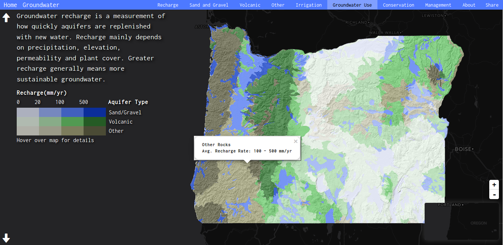

#HSLIDE

# Omeletes sem Ovos
### A poor man's GIS

#HSLIDE

#HSLIDE

### " The only source of knowledge is experience
Albert Einstein

#HSLIDE

### "A jack of all trades is a master of none,
### but often times better than a master of one!<!-- .element: class="fragment" -->
alguém mais inteligente que eu

#HSLIDE

#HSLIDE

## No fundo...

+ conceito <!-- .element: class="fragment" -->
+ ideia <!-- .element: class="fragment" -->
+ ... <!-- .element: class="fragment" -->

#HSLIDE

#HSLIDE

#HSLIDE

#HSLIDE

## Tudo começa com um problema!

---?image=assets/stuck_dog.jpg&size=auto 90%

---?image=assets/cat_tank.jpg&size=auto 90%

---?image=assets/it_guy.jpg&size=auto 85%

#HSLIDE

## Soluções?
+ dialogar <!-- .element: class="fragment" -->
+ explicar o problema <!-- .element: class="fragment" -->
+ mostrar um caminho <!-- .element: class="fragment" -->
+ ... <!-- .element: class="fragment" -->
+ voltar a dialogar <!-- .element: class="fragment" -->

Perca de tempo, níveis de frustração lá em cima <!-- .element: class="fragment" -->

---?image=assets/computer_panda.gif&size=auto

---?image=assets/bruce.gif&size=auto

#HSLIDE

## Go portable

---?image=assets/go_portable.png&size=auto 90%

#HSLIDE

## OK...
### mas e as aplicações de SIG?

#HSLIDE

+ gvSIG 
+ uDig <!-- .element: class="fragment" --> 
+ openJUMP <!-- .element: class="fragment" -->  
+ Saga GIS <!-- .element: class="fragment" -->
+ PostreSQL + PostGIS <!-- .element: class="fragment" -->
+ Spatialite <!-- .element: class="fragment" -->
+ entre outros <!-- .element: class="fragment" -->

#HSLIDE

## Portable

### então e o QGIS?

#HSLIDE

### Um pouco + de trabalho, mas...

- [https://github.com/Frederikssund/Alternativ-QGIS-installation](http://bit.ly/2z9GU0D)

#HSLIDE

### E para quem não quer ter trabalho nenhum

#HSLIDE

+ Desktop GIS packages QGIS version 2.18.11 LTR
+ FWTools (GDAL and OGR toolkit)
+ Apache2 and Php5
+ PostgreSQL (version 9.1)/Postgis (version 2.1)
+ Mapserver 5.6 and 6, OpenLayers
+ Python 2.7 with GDAL 1.9 libraries and Psycopg2
+ ...
+ Geoserver 2.8
+ Utilities- portable firefox, pdf reader and text editor

---?image=assets/sucess.jpg&size=auto 80%

---?image=assets/disney.gif&size=auto

---?image=assets/cat_fail.gif&size=auto

#HSLIDE

### Podemos começar de forma simples

#### Serverless mode

+ Spatialite <!-- .element: class="fragment" -->
+ Geopackage <!-- .element: class="fragment" -->

#HSLIDE

### QGIS Virtual Layers

---?image=assets/qgis_virtual.png&size=auto

---?image=assets/goat.gif&size=auto

#HSLIDE

## Levar o SIG para a rua

- [https://github.com/enricofer/QgisODK](https://github.com/enricofer/QgisODK)
- [https://ona.io](https://ona.io)

---?image=assets/paparazzi.png&size=auto 80%

#HSLIDE

### então e WEB?

---?image=assets/to_internet.gif&size=auto

#HSLIDE

## Não tenho nada...

- [http://www.openstreetmap.org](http://www.openstreetmap.org) <!-- .element: class="fragment" -->

---?image=assets/map.png&size=auto

#HSLIDE

### Pequenas coisas
#### possíveis com uma mão cheia de javascripts

---?image=assets/dados_abertos.png&size=auto 75%

+ feito com o qgis2web <!-- .element: class="fragment" -->
+ alojado no github <!-- .element: class="fragment" -->

#HSLIDE

- [https://github.com/jakobzhao/storymap](https://github.com/jakobzhao/storymap)

---?image=assets/story.png&size=auto 80%

#HSLIDE

### Demo

---?image=assets/Confident-Mindset.jpg&size=auto 80%

#HSLIDE

### Open-Source permite...

+ não só a liberdade de escolha <!-- .element: class="fragment" -->
+ algo mais importante ...<!-- .element: class="fragment" -->
+ a possibilidade de escolha <!-- .element: class="fragment" -->

---?image=assets/thx.png&size=auto 75%

#HSLIDE

## Perguntas?

*  @ulmi
*  @ulmi
*  @hdsantos
