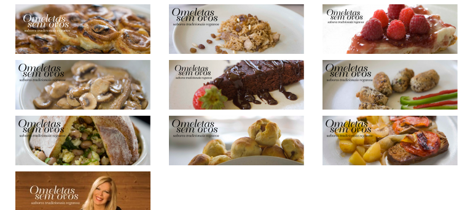
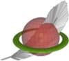
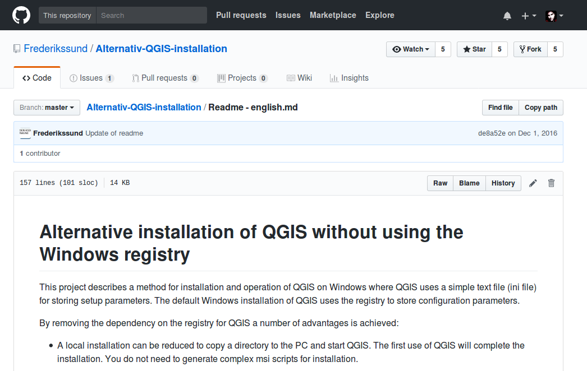
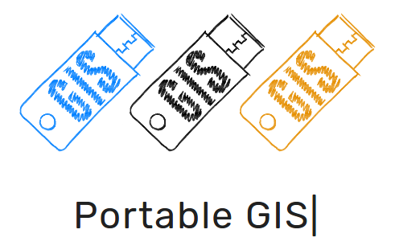
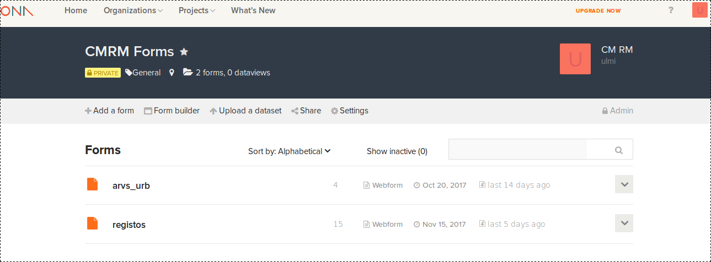

#HSLIDE

# Omeletes sem Ovos
### A poor man's GIS

#HSLIDE

#HSLIDE

# "
### The only source of knowledge is experience
Albert Einstein

#HSLIDE

# "
### A jack of all trades is a master of none,<!-- .element: class="fragment" -->
### but oftentimes better than a master of one!
alguém mais inteligente que eu

#HSLIDE

#HSLIDE

## No fundo...

+ conceito <!-- .element: class="fragment" -->
+ ideia <!-- .element: class="fragment" -->
+ ... <!-- .element: class="fragment" -->

#HSLIDE

#HSLIDE

#HSLIDE

#HSLIDE

## Tudo começa com um problema!

---?image=assets/stuck_dog.jpg&size=auto 90%

---?image=assets/cat_tank.jpg&size=auto 90%

---?image=assets/it_guy.jpg&size=auto 85%

---?image=assets/bruce.gif&size=auto

#HSLIDE

## Soluções?
+ explicar o problema <!-- .element: class="fragment" -->
+ mostrar um caminho <!-- .element: class="fragment" -->
+ ... <!-- .element: class="fragment" -->
+ continuar <!-- .element: class="fragment" -->

Porque realmente só estva a perder tempo e a aumentar os níveis de frustração

---?image=assets/computer_panda.gif&size=auto

#HSLIDE

## Go portable

---?image=assets/go_portable.png&size=auto 90%

#HSLIDE

## OK...
### mas e as aplicações de SIG?

#HSLIDE
+ gvSIG <!-- .element: class="fragment" --> 
+ uDig <!-- .element: class="fragment" --> 
+ openJUMP <!-- .element: class="fragment" -->  
+ Saga GIS <!-- .element: class="fragment" -->
+ PostreSQl + PostGIS <!-- .element: class="fragment" -->
+ Spatialite <!-- .element: class="fragment" -->
+ entre outros <!-- .element: class="fragment" -->

#HSLIDE

## Portable

### então e o QGIS?

#HSLIDE

### Um pouco mais trabalho, mas...

- [https://github.com/Frederikssund/Alternativ-QGIS-installation](http://bit.ly/2z9GU0D)

#HSLIDE

## E para quem não quer ter trabalho nenhum
### Existe o projecto da Jo Cook

#HSLIDE

+ Desktop GIS packages QGIS version 2.18.11 LTR
+ FWTools (GDAL and OGR toolkit)
+ Apache2 and Php5
+ PostgreSQL (version 9.1)/Postgis (version 2.1)
+ Mapserver 5.6 and 6, OpenLayers
+ Python 2.7 with GDAL 1.9 libraries and Psycopg2
+ ...
+ Geoserver 2.8
+ Utilities- portable firefox, pdf reader and text editor

---?image=assets/sucess.jpg&size=auto 90%

#HSLIDE

---?image=assets/disney.gif&size=auto

---?image=assets/cat_fail.gif&size=auto

#HSLIDE

### Podemos começar de forma simples

### Serverless mode

+ Spatialite <!-- .element: class="fragment" -->
+ Geopackage

#HSLIDE

### QGIS Virtual Layers

---?image=assets/qgis_virtual.png&size=auto

---?image=assets/goat.gif&size=auto

#HSLIDE

## Benchmarks

#### Unfortunately, ActionCable leaves much to be desired

Press Down key to see charts and gifs

#VSLIDE

## Memory

#VSLIDE

## CPU

#VSLIDE

## Broadcast Round Trip Time

#HSLIDE

### Let's extract WebSockets somewhere else!

#HSLIDE

## AnyCable

#### Combines the good parts from ActionCable with the power of your favorite language for concurrent applications

How it works? See below

#VSLIDE

## How AnyCable Works

#VSLIDE

## [gRPC](http://grpc.io)

### Makes AnyCable to be a polyglot

#VSLIDE

## AnyCable

#### [Compatible](https://github.com/anycable/anycable#actioncable-compatibility) with ActionCable (channels, javascript, broadcasting)

#### You can still use ActionCable for development and testing

#VSLIDE

## AnyCable Servers

- [anycable-go](https://github.com/anycable/anycable-go)

- [erlycable](https://github.com/anycable/erlycable)

#VSLIDE

## AnyCable

### [Demo Application](https://github.com/anycable/anycable_demo)

#HSLIDE

## Benchmarks Again

#### AnyCable shows much more better performance.

Press Down key to see charts and gifs

#VSLIDE

## Memory

#VSLIDE

## CPU

#VSLIDE

## Broadcast Round Trip Time

#HSLIDE

## Let's Make ActionCable Not Suck!

[anycable.evilmartians.io](http://anycable.io/)

Vladimir Dementyev [@palkan_tula](http://twitter.com/palkan_tula)

[Evil Martians](http://evilmartians.com)

Twitter [@any_cable](http://twitter.com/any_cable)

GitHub [@anycable](http://github.com/anycable)
